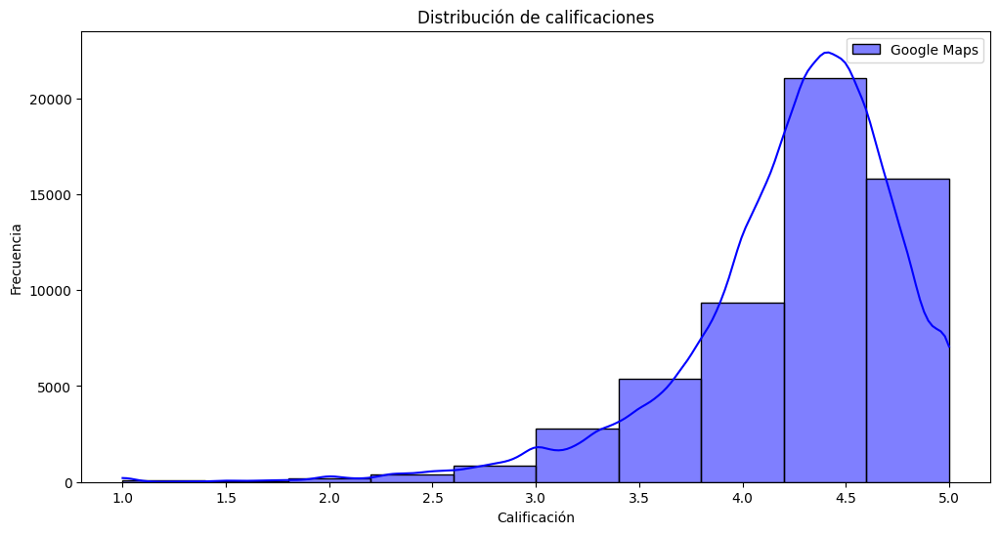

# 
    Informe del Sprint 1

# Entendimiento de la situación actual

Situados en el rol de integrantes de la consultora QUINQUE, proponemos un proyecto en base al analisis integral del feedback de los clientes  a bares en Estados Unidos que contribuya a mejorar tanto la experiencias de dichos clientes como la calidad de los establecimientos.

Con esto en mente nuestra propuesta  es desarrollar, en base a un analisis exhaustivo de datos obtenido de plataformas digitales, un modelo de machine lerning que destaca las areas clave que deben ser abordadas, brindando una estimacion del margen de crecimiento de acuerdo a la siutacion de cada establecimiento y un dashboard para visualizar la situacion actual, la evolucion y el progreso e impacto de las modificacion en base a indicadores clave de desempeño (KPI)

Para lograr nuestro cometido relizamos un analisis de las interacciones de los usuarios en las plataformas de Google Map y Yelp. Dichas interacciones constan de reseñas en forma de texto y calificaciones en forma de estrellas en un rango de 1 a 5.

# Alcance

El alcance del proyecto propuesto implica el análisis integral del feedback de los clientes a bares en Estados Unidos utilizando datos recopilados de plataformas de Google Maps y Yelp desde 2015 hasta 2021. Se desarrollará un modelo de machine learning para identificar las áreas clave a mejorar y estimar el margen de crecimiento de los establecimientos como tambien un dashboard para visualizar los datos de mayor importancia.

# ***Objetivo***

Nuestro objetivo consisite en ayudar a nuestro cliente a mejorar la experiencia de sus clientes, fortaleciendo la imagen del los establecimientos, fomentando así la participación y retroalimentación de los usuarios en las plataformas digitales.

Con dicho objetivo en mente planteamos los siguientes indicadores clave de desempeño (KPI's) para poder medir el rendimiento y la evolucion de los establecimientos:

## Índice de satisfacción del cliente:

Este KPI refleja el nivel de satisfacción de los clientes en base al promedio de las calificaciones. Lo planteamos debido a que la satisfacción del cliente es un indicador clave para evaluar el desempeño del negocio y la calidad de sus servicios. Su funcion principal es evaluar la situación del establecimiento y su evolución a lo largo del tiempo. Será clave para determinar el impacto de las modificaciones en las áreas a mejorar. El objetivo es aumentar el promedio de satisfacción en al menos un 20% en un plazo de 6 a 12 meses.

## Índice de participación y retroalimentación de los clientes:

Este KPI evalúa el nivel de participación y retroalimentación de los clientes en base a la cantidad de reseñas. Lo plantemos ya que las interacciones y feedabacks de los clientes son fundamentales para evaluar la satisfacción y el nivel de interes de los clientes para con el establecimiento. El objetivo es aumentar el número total de reseñas en al menos un 25% en un plazo de 6 a 12 meses.

## Índice de reputación del establecimiento:

Este KPI evalúa la imagen del establecimiento basándose en el porcentaje de calificaciones positivas y negativas. Su elevaoracion esta fundada en que la imagen y reputación del establecimiento son factores de gran importacia en la atracción de nuevos clientes y en la fidelización de los existente. El objetivo es aumentar el porcentaje de calificaciones postivas en al menos un 20%  en un plazo de 6 a 12 meses a través de las acciones estrategicas en las areas clave.

# ***Tareas llevadas a cabo:***

a. Recopilacion y exploracion de los datos enfocados a bares de Estados Unidos.

b. Análisis exploratorio de los datos para identificar patrones y tendencias.

c. Aplicacion de técnicas de limpieza y preprocesamiento de datos que garanticen su calidad.

d. Realizacion de análisis estadísticos y modelos de correlación.

e.Determinacion de las areas calves a mejorar.

f. Desarrollo de un modelo predictivo utilizando técnicas de aprendizaje automático para estimar el éxito potencial de nuevos locales.

g. Recomendaciones accionables basadas en los hallazgos del análisis.

## ***Stack tecnológico***

**Herramientas de colaboración y gestión de proyectos**

- Discord
- Google meet
- GitHub

**Lenguaje de programación:**

- Python
- DAX
- HTML

**Bibliotecas y frameworks:**

- Wordcloud
- NumPy
- Pandas
- Scikit-learn
- Matplotlib / Seaborn
- NLTK
- SciPy

**Herramientas de visualización de datos:**

- Prezi
- PowerBI

**Data Wherehouse  y base de datos:**

- Google Cloud Plataform:
  - Cloud Storage
  - Bucket
  - BigQuery
  - Cloud Functions

## Metodología de trabajo:

 Utilizamos para el desarrollo del proyecto la metodología ágil Scrum. El equipo se organizó en sprints de una semana de duración, con reuniones diarias de seguimiento y una reunión de revisión al final de cada sprint. Se puede observar del cronograma general en el siguiente diagrama de Gantt:

### Roles

- **_Data Analyst_**: Kevin Bambozzi, Martin Sayago
- **_Data Engineer_**: Alex Dalpiaz, Jeremias Ramirez, Yamil Pintos
- **_Data Science_**: Alex Dalpiaz, Jeremias Ramirez, Yamil Pintos, Kevin Bambozzi, Martin Sayago

# Análisis preliminar de calidad de datos:

El siguiente análisis preliminar proporciona una visión general de los datos recopilados de las plataformas de Google Maps y Yelp sobre bares en Estados Unidos. A través de los gráficos y visualizaciones presentados, se pueden extraer varias conclusiones.

### Distribucion de las estrellas en Google

Observamos que la mayoría de las puntuaciones se encuentran entre 4 y 5 estrellas, lo que sugiere que la mayoría de las personas están satisfechas con el lugar evaluado o que los usuario no aplican un critica objetiva. Tambien existe una fuerte inclinación hacia las 5 estrellas, lo cual indica una tendencia de los usuarios de calificar los establecimientos con la puntuación máxima.

Al establecer un umbral para considerar un puntaje bajo, se ha definido un valor de 3.0 o menos, ya que parece haber un pico notable de frecuencia en este rango, que separa un incremento en la cantidad de puntajes. Por otro lado, se ha definido un umbral para considerar un puntaje alto, estableciendo un valor de 4.5 o más. Esto se basa en la alta frecuencia de calificaciones de 5 estrellas, lo que indica un alto grado de satisfacción por parte de los evaluadores. El rango de puntajes moderados se ha establecido entre 3.0 y 4.5. Esta categoría incluiría calificaciones que no son ni muy bajas ni muy altas, lo que puede indicar una satisfacción parcial o alguna área de mejora identificada por los evaluadores.

En resumen, la mayoría de las calificaciones son altas, con una inclinación hacia las 5 estrellas. Sin embargo, también existen algunas calificaciones bajas y una categoría de puntajes moderados que indican distintos niveles de satisfacción entre los evaluadores. Esto puede indicar que los usuarios estan inclinados a dejar puntuaciones altas, a diferencia de las bajas.

El pico más alto del puntaje en el gráfico está muy cerca del puntaje promedio anterior. Esto indica que hay una concentración significativa de calificaciones en torno al puntaje promedio, lo que sugiere que muchos usuarios han otorgado calificaciones cercanas al promedio. Esto significa que la mayoría de las calificaciones se encuentran en el rango moderado, con una inclinación hacia los puntajes más altos.

La principal diferencia notada en el gráfico es la cantidad de puntajes de 5 estrellas, que es menos frecuente en comparación con los puntajes promedio y los puntajes altos. Esto indica que hay menos usuarios que han otorgado calificaciones máximas de 5 estrellas, lo cual puede ser un reflejo de una cierta reticencia a otorgar la máxima calificación.

En resumen, el gráfico muestra una similitud general con los datos anteriores, con una concentración de calificaciones alrededor del puntaje promedio. Sin embargo, la diferencia notable es la menor frecuencia de calificaciones de 5 estrellas, lo que sugiere que hay menos usuarios que otorgan la máxima calificación en comparación con los puntajes promedio y altos.

Por otro lado, en el analisis de datos inicial observamos que hay un total de 55,987 calificaciones en Google Maps sobre bares. Esto indica la cantidad de puntuaciones que los usuarios han dejado sobre estos establecimientos en la plataforma.
El total de reviews de bares es de 6,110,842. Esta cifra representa la suma de todas las valoraciones y comentarios que los usuarios han realizado sobre los bares en cuestión.

El puntaje promedio de los bares es de 4.24. Es importante tener en cuenta que este valor promedio se basa en las calificaciones proporcionadas por los usuarios y puede variar a lo largo del tiempo.

En resumen, hay un número significativo de calificaciones y reviews de bares en Google Maps, lo que indica que los usuarios están activamente compartiendo sus experiencias y opiniones sobre estos establecimientos. El puntaje promedio de los bares es positivo, con una calificación promedio de alrededor de 4.24 estrellas, que es cercano a los picos de cantidad de puntuaciones en los graficos anteriores.

### Tipos de Bares en Google

Se puede concluir que en esta ubicación específica se observa una distribución de diferentes tipos de bares. Los dos tipos más populares son los girl bars y los cocktail bars, lo que sugiere que hay una demanda significativa de lugares donde el servicio es proporcionado por mujeres y la variedad de tragos son los principales atractivos.

Además, los cider bars también tienen una presencia considerable, con la cidra como la atracción principal. Esto indica que hay interés en este tipo de bebida y posiblemente una clientela que busca experiencias relacionadas con la cidra.

Los poke bars, siendo bares hawaianos, también tienen un lugar en la distribución de bares, lo que podría sugerir que existe una apreciación por la cocina y cultura hawaiana en esta área.

Sin embargo, es importante tener en cuenta que el eyebrow bar, que es un salón de belleza especializado en cejas y pestañas, no está relacionado con la propuesta de bares y se filtrará del conjunto de trabajo. Por lo que no forma parte de la distribución de bares y puede considerarse una información adicional sin relevancia para el análisis de los bares en cuestión.

### Distribucion de las estrellas en Yelp

~~IMAGEN DE LA DITRUBCION DE ESTRELLAS~~

Observamos que la mayoría de las puntuaciones se encuentran en 1 y 5 estrellas, lo que sugiere que las opiniones de las personas son polarizadas y aplican una crítica objetiva, lo cual está en línea con el enfoque de la plataforma. Además, se nota una fuerte inclinación hacia las 5 estrellas.

Al igual que con los datos de Google, establecimos un umbral para considerar un puntaje bajo, definiendo un valor de 3.0 o menos, y un umbral para considerar un puntaje alto, estableciendo un valor de 4.5 o más. Esta elección se basó en la alta frecuencia de calificaciones de 5 estrellas, lo que indica un alto grado de satisfacción por parte de los usuarios. El rango de puntajes moderados se estableció entre 3.0 y 4.5. Esta categoría incluiría calificaciones que no son ni muy bajas ni muy altas, lo que puede indicar una satisfacción parcial o la identificación de áreas de mejora por parte de los evaluadores.

En resumen, la mayoría de las calificaciones son altas, con una inclinación hacia las 5 estrellas. Sin embargo, también se observa un número considerable de calificaciones bajas que indican diferentes niveles de satisfacción entre los evaluadores. Esto sugiere que los usuarios tienden a dejar puntuaciones altas en general, en contraste con las puntuaciones bajas.

### Nube de palabras con las reseñas de Yelp:

Observamos que las palabras sugieren las siguientes cuestiones:

* Diversificación en el mercado: Los diferentes tipos de bares indican una tendencia hacia la diversificación y especialización en la oferta gastronómica y de bebidas.
* Experiencias temáticas: La variedad de tipos de bares sugiere la existencia de experiencias temáticas y especializadas para atraer a los clientes.
* Personalización y segmentación: Los consumidores buscan lugares que se adapten a sus gustos y necesidades individuales, lo que requiere una oferta más enfocada y diferenciada.
* Innovación y creatividad: Los tipos de bares poco convencionales reflejan un enfoque en la innovación y la creatividad para destacarse en un mercado competitivo.

### Nube de palabras relacionadas a Beer

Al realizar una nube de palabras relacionada con la palabra "beer", extragimos palabras relevantes que brindan información sobre las características y aspectos asociados a las cervezas. Algunas de estas palabras pueden incluir "happy hour", "food great" y otras que se mencionan con menos frecuencia.
La nube de palabras relacionada con "beer" revela aspectos relevantes de las cervezas, como "happy hour" y "food great". Las promociones especiales durante el "happy hour" atraen clientes y aumentan las ventas. La presencia menos frecuente de "food great" sugiere oportunidades de mejora en la oferta gastronómica. Desarrollar un menú de alta calidad que complemente la cerveza puede mejorar la experiencia culinaria. Estos hallazgos son útiles para determinar los factores clave del éxito y sugerir mejoras en los lugares con oportunidades perdidas.

# **Conclusión**

En conclusión, nuestra propuesta para mejorar la experiencia de los clientes y la calidad de los bares en Estados Unidos se basa en el análisis integral del feedback de los clientes a través de plataformas digitales. Nuestro enfoque utiliza machine learning y un exhaustivo análisis de datos para identificar áreas clave de mejora y estimar el margen de crecimiento de cada establecimiento. Además, se proporciona un dashboard para visualizar la evolución y el impacto de las modificaciones en base a los indicadores clave de desempeño. Con esta metodología, esperamos impulsar los bares y garantizar una experiencia satisfactoria para los clientes.

## Link De Repositorio:

**_Github:_** [https://github.com/alexDRandom/Proyecto-Final-Henry](https://github.com/alexDRandom/Proyecto-Final-Henry)
