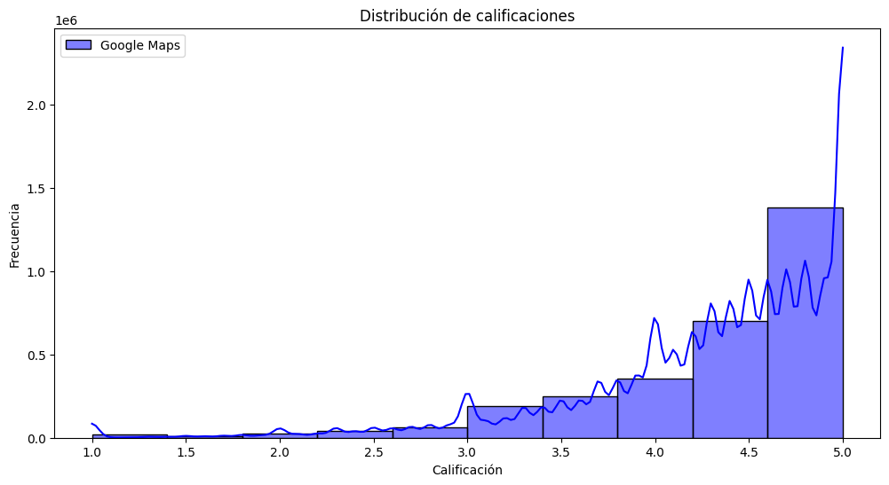
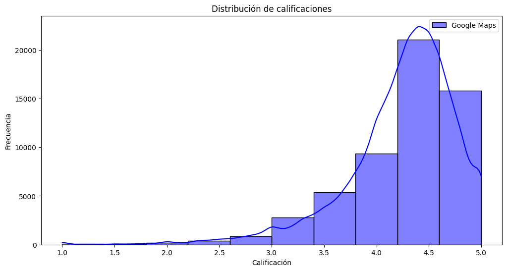
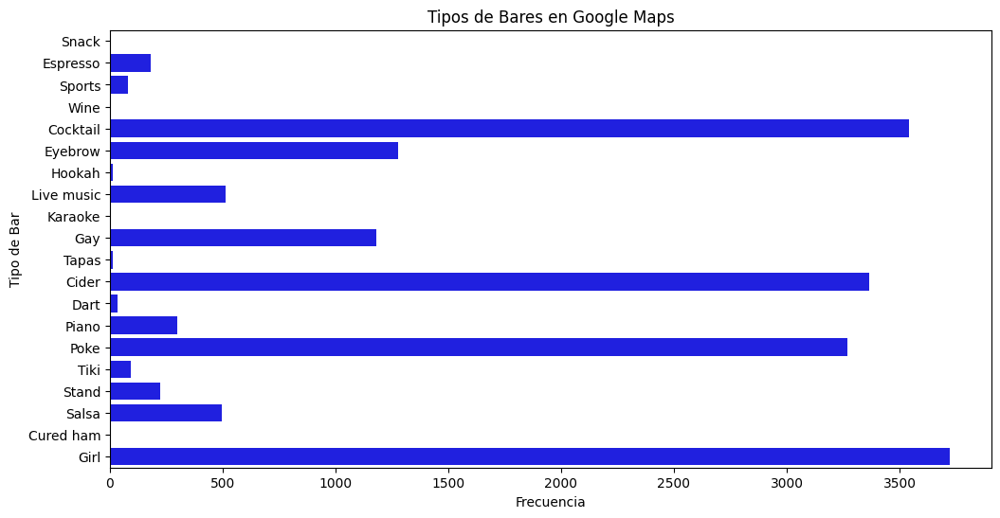
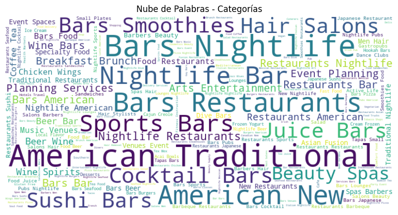
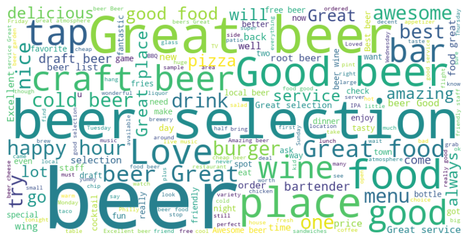

# Dataset Google Maps

La mayoría de las puntuaciones se encuentran entre 4 y 5 estrellas, lo que sugiere que la mayoría de las personas están satisfechas con el lugar evaluado. Tambien existe una fuerte inclinación hacia las 5 estrellas, lo cual indica una tendencia de los usuarios de calificar los establecimientos con la puntuación máxima.

Al establecer un umbral para considerar un puntaje bajo, se ha definido un valor de 3.0 o menos, ya que parece haber un pico notable de frecuencia en este rango, que separa un incremento en la cantidad de puntajes. Por otro lado, se ha definido un umbral para considerar un puntaje alto, estableciendo un valor de 4.5 o más. Esto se basa en la alta frecuencia de calificaciones de 5 estrellas, lo que indica un alto grado de satisfacción por parte de los evaluadores. El rango de puntajes moderados se ha establecido entre 3.0 y 4.5. Esta categoría incluiría calificaciones que no son ni muy bajas ni muy altas, lo que puede indicar una satisfacción parcial o alguna área de mejora identificada por los evaluadores.

En resumen, la mayoría de las calificaciones son altas, con una inclinación hacia las 5 estrellas. Sin embargo, también existen algunas calificaciones bajas y una categoría de puntajes moderados que indican distintos niveles de satisfacción entre los evaluadores. Esto puede indicar que los usuarios estan inclinados a dejar puntuaciones altas, a diferencia de las bajas.

El pico más alto del puntaje en el gráfico está muy cerca del puntaje promedio anterior. Esto indica que hay una concentración significativa de calificaciones en torno al puntaje promedio, lo que sugiere que muchos usuarios han otorgado calificaciones cercanas al promedio. Esto significa que la mayoría de las calificaciones se encuentran en el rango moderado, con una inclinación hacia los puntajes más altos.

La principal diferencia notada en el gráfico es la cantidad de puntajes de 5 estrellas, que es menos frecuente en comparación con los puntajes promedio y los puntajes altos. Esto indica que hay menos usuarios que han otorgado calificaciones máximas de 5 estrellas, lo cual puede ser un reflejo de una cierta reticencia a otorgar la máxima calificación.

En resumen, el gráfico muestra una similitud general con los datos anteriores, con una concentración de calificaciones alrededor del puntaje promedio. Sin embargo, la diferencia notable es la menor frecuencia de calificaciones de 5 estrellas, lo que sugiere que hay menos usuarios que otorgan la máxima calificación en comparación con los puntajes promedio y altos.

Por otro lado, en el analisis de datos inicial observamos que hay un total de 55,987 calificaciones en Google Maps sobre bares. Esto indica la cantidad de puntuaciones que los usuarios han dejado sobre estos establecimientos en la plataforma.
El total de reviews de bares es de 6,110,842. Esta cifra representa la suma de todas las valoraciones y comentarios que los usuarios han realizado sobre los bares en cuestión.

El puntaje promedio de los bares es de 4.24. Es importante tener en cuenta que este valor promedio se basa en las calificaciones proporcionadas por los usuarios y puede variar a lo largo del tiempo.

En resumen, hay un número significativo de calificaciones y reviews de bares en Google Maps, lo que indica que los usuarios están activamente compartiendo sus experiencias y opiniones sobre estos establecimientos. El puntaje promedio de los bares es positivo, con una calificación promedio de alrededor de 4.24 estrellas, que es cercano a los picos de cantidad de puntuaciones en los graficos anteriores.

Se puede concluir que en esta ubicación específica se observa una distribución de diferentes tipos de bares. Los dos tipos más populares son los girl bars y los cocktail bars, lo que sugiere que hay una demanda significativa de lugares donde el servicio es proporcionado por mujeres y la variedad de tragos son los principales atractivos.

Además, los cider bars también tienen una presencia considerable, con la cidra como la atracción principal. Esto indica que hay interés en este tipo de bebida y posiblemente una clientela que busca experiencias relacionadas con la cidra.

Los poke bars, siendo bares hawaianos, también tienen un lugar en la distribución de bares, lo que podría sugerir que existe una apreciación por la cocina y cultura hawaiana en esta área.

Sin embargo, es importante tener en cuenta que el eyebrow bar, que es un salón de belleza especializado en cejas y pestañas, no está relacionado con la propuesta de bares y se filtrará del conjunto de trabajo. Por lo que no forma parte de la distribución de bares y puede considerarse una información adicional sin relevancia para el análisis de los bares en cuestión.

# Dataset Yelp

Con la nube de palabras podemos inferir las siguientes cuestiones:
Diversificación en el mercado: Los diferentes tipos de bares indican una tendencia hacia la diversificación y especialización en la oferta gastronómica y de bebidas.
Experiencias temáticas: La variedad de tipos de bares sugiere la existencia de experiencias temáticas y especializadas para atraer a los clientes.
Personalización y segmentación: Los consumidores buscan lugares que se adapten a sus gustos y necesidades individuales, lo que requiere una oferta más enfocada y diferenciada.
Innovación y creatividad: Los tipos de bares poco convencionales reflejan un enfoque en la innovación y la creatividad para destacarse en un mercado competitivo.

Al realizar una nube de palabras relacionada con la palabra "beer", se pueden extraer palabras o frases relevantes que brindan información sobre las características y aspectos asociados a las cervezas. Algunas de estas palabras pueden incluir "happy hour", "food great" y otras que se mencionan con menos frecuencia.
La nube de palabras relacionada con "beer" revela aspectos relevantes de las cervezas, como "happy hour" y "food great". Las promociones especiales durante el "happy hour" atraen clientes y aumentan las ventas. La presencia menos frecuente de "food great" sugiere oportunidades de mejora en la oferta gastronómica. Desarrollar un menú de alta calidad que complemente la cerveza puede mejorar la experiencia culinaria. Estos hallazgos son útiles para determinar los factores clave del éxito y sugerir mejoras en los lugares con oportunidades perdidas.

Analisis de sentimientos tip.json columna "text"

A partir del análisis de sentimiento de las reseñas, se puede inferir que los bares tienen en general una buena reputación y satisfacen las expectativas de sus clientes. La mayoría de las reseñas muestran un sentimiento positivo, lo que sugiere que los clientes disfrutan de su experiencia en los bares y están satisfechos con la calidad de la cerveza, el ambiente y el servicio. Sin embargo, también se identifican algunas reseñas con un sentimiento negativo, lo que indica que existen áreas de mejora y posibles problemas que deben abordarse para mantener la satisfacción del cliente

