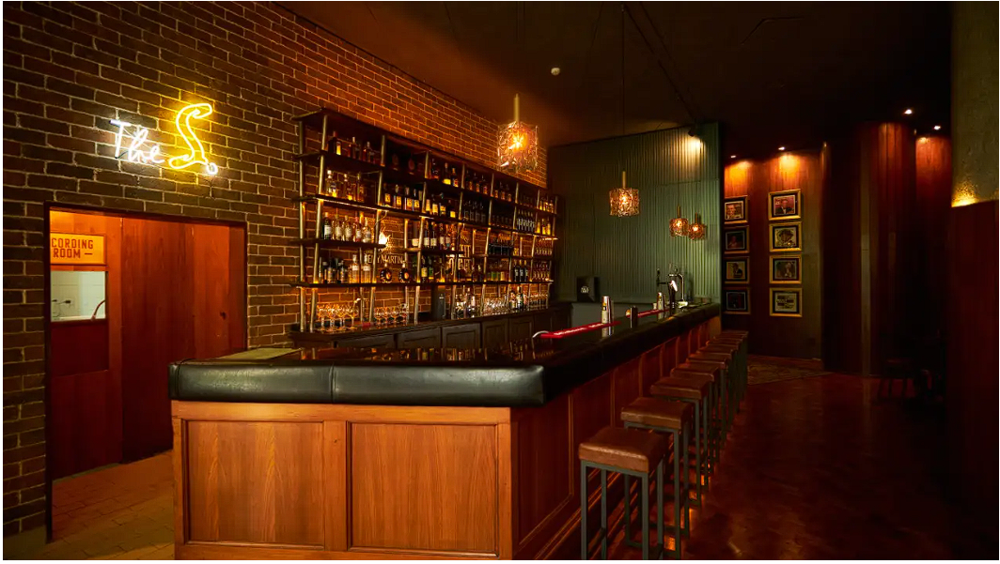
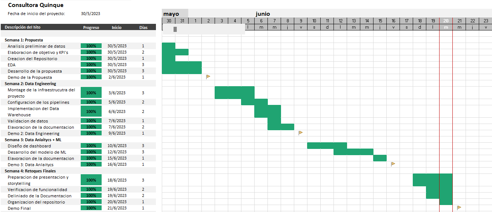

# <h1 align=center> **`PROYECTO FINAL - Sistema de Recomendación para la Mejora De Bares`** </h1>

# <h1 align=center> 

 </h1>

En representación de la consultora QUINQUE, nos complace compartir con ustedes un emocionante proyecto en el que nos hemos embarcado con el fin de satisfacer la necesidad de nuestro cliente, quien requiere un análisis integral que contribuya a mejorar la calidad y la experiencia de sus clientes en bares de Estados Unidos a través del feedback e interacciones de los usuarios.

Nuestra propuesta consiste en desarrollar, basándonos en un análisis exhaustivo de datos obtenidos de plataformas digitales, un modelo de machine learning que destaque las áreas clave que deben abordarse. Esto brindará una estimación del margen de crecimiento de acuerdo a la situación de cada establecimiento, junto con un dashboard para poder visualizar la situación actual, la evolución y el progreso e impacto de las modificaciones, a través de indicadores clave de desempeño (KPI).

Para llevarlo a cabo, realizamos un análisis de las interacciones de los usuarios en las plataformas de Google Maps y Yelp en relación a los bares. Estas interacciones constan de reseñas en forma de texto y calificaciones en forma de estrellas en un rango de 1 a 5.

# Objetivo

Nuestro objetivo consiste en ayudar a mejorar la experiencia de los clientes y fortalecer la imagen de los establecimientos. Buscamos plantear, a su vez, la implementación de acciones estratégicas en las áreas clave destacadas por nuestro modelo, que impulsen la satisfacción, fomenten la participación y retroalimentación.

Con dicho objetivo en mente, planteamos los siguientes KPI para medir el rendimiento:

### Índice de satisfacción del cliente:

Este KPI refleja el nivel de satisfacción de los clientes en base al promedio de las calificaciones. Lo planteamos debido a que la satisfacción del cliente es un indicador clave para evaluar el desempeño del negocio y la calidad de sus servicios. Su funcion principal es evaluar la situación del establecimiento y su evolución a lo largo del tiempo. Será clave para determinar el impacto de las modificaciones en las áreas a mejorar. El objetivo es aumentar el promedio de satisfacción en al menos un 20% en un plazo de 6 a 12 meses.

### Índice de participación y retroalimentación de los clientes:

Este KPI evalúa el nivel de participación y retroalimentación de los clientes en base a la cantidad de reseñas. Lo plantemos ya que las interacciones y feedabacks de los clientes son fundamentales para evaluar la satisfacción y el nivel de interes de los clientes para con el establecimiento. El objetivo es aumentar el número total de reseñas en al menos un 25% en un plazo de 6 a 12 meses.

### Índice de reputación del establecimiento:

Este KPI evalúa la imagen del establecimiento basándose en el porcentaje de calificaciones positivas y negativas. Su elevaoracion esta fundada en que la imagen y reputación del establecimiento son factores de gran importacia en la atracción de nuevos clientes y en la fidelización de los existente. El objetivo es aumentar el porcentaje de calificaciones postivas en al menos un 20%  en un plazo de 6 a 12 meses a través de las acciones estrategicas en las areas clave.

# ***Tareas llevadas a cabo:***

a. Recopilacion y exploracion de los datos enfocados a bares de Norte America.

b. Análisis exploratorio de los datos para identificar patrones y tendencias.

c. Aplicacion de técnicas de limpieza y preprocesamiento de datos que garanticen su calidad.

d. Realizacion de análisis estadísticos y modelos de correlación.

e.Determinacion de las areas calves a mejorar.

f. Desarrollo de un modelo predictivo utilizando técnicas de aprendizaje automático para estimar el éxito potencial de nuevos locales.

g. Planteo de recomendaciones accionables basadas en los hallazgos del análisis.

# ***Stack tecnológico***

**Herramientas de colaboración y gestión de proyectos**

- Discord
- Google meet
- GitHub

**Lenguaje de programación:**

- Python
- DAX
- HTML

**Bibliotecas y frameworks:**

- Wordcloud
- NumPy
- Pandas
- Scikit-learn
- Matplotlib / Seaborn
- NLTK
- SciPy

**Herramientas de visualización de datos:**

- Prezi
- PowerBI

**Data Wherehouse  y base de datos:**

- Google Cloud Plataform:
  - Cloud Storage
  - Bucket
  - BigQuery
  - Cloud Functions

# Metodología de trabajo:

 Utilizamos para el desarrollo del proyecto la metodología ágil Scrum. El equipo se organizó en sprints de una semana de duración, con reuniones diarias de seguimiento y una reunión de revisión al final de cada sprint. Se puede observar del cronograma general en el siguiente diagrama de Gantt:

# Roles:

- **_Data Analyst_**: Kevin Bambozzi, Martin Sayago
- **_Data Engineer_**: Alex Dalpiaz, Jeremias Ramirez, Yamil Pintos
- **_Data Science_**: Alex Dalpiaz, Jeremias Ramirez, Yamil Pintos, Kevin Bambozzi, Martin Sayago

# Análisis preliminar de calidad de datos:

Mediante el uso de diversas técnicas de análisis de datos, exploramos los factores producto de la expriencia de los clientes en los distintos establecimientos. Presentamos los principales hallazgos de nuestro análisis en la carpeta de Documentacion [Informe_Sprint_1_Propuesta_de_Proyecto.md](https://github.com/alexDRandom/Proyecto-Final-Henry/blob/main/Documentacion/Informe_Sprint_1_Propuesta_de_Proyecto.md)

# Ingeniería de datos

En la carpeta Documentacion, detallamos el proceso de creación del Data Warehouse y los Pipelines que automatizan la carga de los datos ya limpios. Tambien se pueden apreciar el Diagrama Entidad-Relación y el diccionario de datos los cuales facilitan el entendimiento de la relaciones que albergan los datasets. Para más detalles ver [Informe_Sprint_2_Data_Engineering.md](https://github.com/alexDRandom/Proyecto-Final-Henry/blob/main/Documentacion/Informe_Sprint_2_Data_Engineering.md)

# Machine Learning y Dashboard:

El desarrollo del modelo de machine learning y el dashboard en Power BI se encuentra detallado en el [Infome_Sprint_3_ML_y_Dasboard.md](https://github.com/alexDRandom/Proyecto-Final-Henry/blob/main/Documentacion/Infome_Sprint_3_ML_y_Dasboard.md)

# Acciones Estratégicas Sugeridas

1. Implementar un programa de mejora continua en base a las sugerencias y comentarios de los clientes, para abordar las áreas de oportunidad identificadas por el modelo.
2. Fomentar la participación de los clientes a través de incentivos, promociones especiales o programas de lealtad que estimulen la retroalimentación y la generación de reseñas positivas.
3. Capacitar al personal en habilidades de servicio al cliente y establecer estándares claros para garantizar una respuesta rápida y efectiva a las reseñas y comentarios de los clientes.
4. Monitorear regularmente las calificaciones y comentarios recibidos, identificando tendencias y patrones para abordar rápidamente cualquier problema o preocupación que pueda afectar la reputación del establecimiento.
5. Realizar campañas de marketing y comunicación para resaltar los aspectos positivos del establecimiento, destacando las experiencias satisfactorias de los clientes y promoviendo la imagen positiva del negocio.

# Concluciones 

En conclusión, este proyecto ha sido una experiencia enriquecedora que ha combinado análisis de datos, machine learning y estrategias efectivas para mejorar la experiencia del cliente y fortalecer la reputación de los establecimientos. Estamos convencidos de que nuestras acciones contribuirán al crecimiento y éxito a largo plazo de nuestros clientes en la industria de bares en Estados Unidos.

## Link generales del repositorio:

**_Github:_** [https://github.com/alexDRandom/Proyecto-Final-Henry](https://github.com/alexDRandom/Proyecto-Final-Henry)
